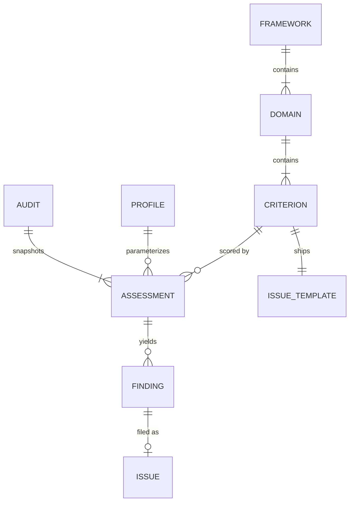

# Kritik — the Pebbles Quality Audit Framework

**Version 0.1.0 · 2026-08-26 · status: proposal (first full audit run in `audits/2026-08/`)**

Kritik is a quality audit framework built to answer one question repeatedly and comparably: *how good is each surface of this product, on every dimension that matters, and what exactly do we fix first?* It was designed on Pebbles (five surfaces: web, iOS, Android, admin, Supabase) but every product-specific choice is isolated in a profile, so the framework itself is reusable — and is designed to graduate into Arkaik as a first-class quality library + monitoring feature (see [`arkaik-integration.md`](./arkaik-integration.md)).

The name follows the Arkaik family convention (Synk, Publik, Kommit, Lokal): *Kritik* is the critique layer of the product graph.

---

## 1. Principles

1. **Evidence-bound.** A score without a `file:line`, config key, or reproduced behavior behind it is an opinion, not an assessment. Every score and every finding cites evidence pinned to a commit hash.
2. **Product-agnostic criteria, product-specific assessments.** Criteria are written for a *product class* (multi-client + shared database). What is particular to one product lives in its **profile** (domain weights, surface list) and its **assessments** — never in the criteria library.
3. **Comparable across surfaces.** The same criterion is scored with the same anchors on every surface it applies to. That is what makes the matrix a matrix and not five unrelated reports.
4. **Maturity, not vibes.** The 0–4 scale scores *how systematically* a concern is handled, with observable anchors per criterion. "The code happens to be fine today" and "CI makes it impossible to regress" are different scores.
5. **Risk is separate from maturity.** Maturity says how well a criterion is met; findings carry risk (impact × likelihood) and cost. A domain can be maturity-3 and still hold one Critical finding — and the roll-up rules make that finding impossible to average away.
6. **Machine-modelable.** Everything here round-trips through JSON (`library/framework.json`, `audits/*/findings.json`, `audits/*/scores.json`). Reports and matrices are projections of the data, never the source of truth.
7. **Adversarially verified.** Critical and High findings are only *retained* after an independent agent attempted to refute them. Refuted findings are disclosed, not deleted.

## 2. Entity model



| Entity | What it is | Lives in |
| --- | --- | --- |
| **Framework** | The versioned library of domains + criteria + scales | `library/framework.json` |
| **Domain** | Top-level category (Security, Privacy, …), owns criteria and a roll-up | `library/framework.json` |
| **Criterion** | The atomic auditable unit: question, definition, anchors, references, checklist, signals, issue template | `library/framework.json` |
| **Profile** | A product's parameterization: surfaces, domain weights, applicability overrides | `library/framework.json` (`profiles.pbbls`) |
| **Audit** | One dated run against one commit: all assessments + findings + the matrix | `audits/<YYYY-MM>/` |
| **Assessment** | One (criterion × surface) score with evidence | `audits/<YYYY-MM>/scores.json` |
| **Finding** | One concrete defect/gap: severity, cost, priority, evidence, remediation | `audits/<YYYY-MM>/findings.json` |
| **Issue template** | Per-criterion GitHub issue skeleton, generated from the library | `templates/` |

## 3. Domains

Eleven domains. Codes are stable identifiers; criteria ids are `<CODE>-NN`.

| Code | Domain | What it audits |
| --- | --- | --- |
| `SEC` | Security | Authn/authz (RLS, security-definer RPCs), secrets, injection, transport/storage, supply chain, API hardening |
| `PRV` | Privacy & Data Protection | Minimization, PII flows, telemetry restraint, logs hygiene, media handling, deletion propagation, exposure surfaces |
| `GDP` | GDPR & Regulatory | Lawful basis, Art. 9 special-category posture, data-subject rights, transparency, processors, retention, breach readiness |
| `SAF` | Safety & Wellbeing | Crisis pathways, emotionally safe design, UGC moderation, social abuse vectors, bystander privacy, minors |
| `ARC` | Code Quality & Architecture | Single responsibility, atomicity, layering, typing, conventions, duplication, platform idioms, schema quality |
| `TST` | Testing & Verification | Core-path coverage, cross-surface contract tests, regression protection, harnesses, CI gates |
| `PLT` | Platform & Store Compliance | App Store / Play policies, PWA standards, deployment platform posture, Supabase platform best practices |
| `A11Y` | Accessibility & Inclusion | WCAG 2.2 AA, VoiceOver/TalkBack, Dynamic Type/font scale, theming, motion, i18n (EN/FR) |
| `PRF` | Performance & Efficiency | Web Vitals, bundles, media pipeline, query efficiency, mobile startup, caching, network frugality |
| `REL` | Reliability & Observability | Failure surfacing, timeouts/retries, integrity under partial failure, offline, migration safety, crash reporting |
| `AGT` | Agentic Development Readiness | Instruction-doc accuracy, map freshness, verifiability, encoded guardrails, determinism, decision memory |

Domain boundaries that recur in practice: **PRV** is the engineering posture (what the code does with data); **GDP** is the regulation mapping (what the law requires you to demonstrate). **SAF** owns harm to humans; **SEC** owns unauthorized access. **AGT** owns whether an *agent* can verify a change; **TST** owns whether the change is verified at all.

## 4. Scales

### 4.1 Maturity (per criterion × surface) — the score in the matrix cells

| Level | Name | Meaning (generic; every criterion carries its own concrete anchors) |
| --- | --- | --- |
| **0** | Absent | The concern is not addressed at all |
| **1** | Ad-hoc | Addressed accidentally or in one spot; no visible intent |
| **2** | Defined | Deliberately addressed; visible intent; known gaps |
| **3** | Managed | Systematically addressed across the surface; tested or reviewed |
| **4** | Verified | Enforced by automation, a CI gate, or a runnable harness; drift is *detected*, not hoped against |
| — | N/A | Criterion does not apply to this surface (from `applies_to`, or a justified profile override) |

Half-points are not allowed. When torn between two levels, score the lower one and record why.

### 4.2 Finding severity — risk = impact × likelihood (5×5)

**Impact** (worst plausible consequence if exploited/hit):

| I | Anchor |
| --- | --- |
| 5 | Catastrophic: intimate-data breach at scale, legal action, store removal, unrecoverable data loss |
| 4 | Severe: single-user data exposure, rights violation, silent data corruption, prolonged outage |
| 3 | Major: degraded trust or safety for some users, recoverable data loss, compliance gap with deadline exposure |
| 2 | Minor: friction, confusion, quality erosion, internal-only exposure |
| 1 | Negligible: cosmetic, informational |

**Likelihood** (probability the impact materializes under real usage/attack):

| L | Anchor |
| --- | --- |
| 5 | Certain / already happening (reproduced, or triggered by normal use) |
| 4 | Likely: ordinary conditions or an unskilled attacker suffice |
| 3 | Possible: needs specific-but-plausible conditions or moderate skill |
| 2 | Unlikely: needs rare conditions or high skill + motivation |
| 1 | Rare: theoretical, defense-in-depth only |

**Severity buckets** over `I × L` (1–25):

| Severity | Score | Marker |
| --- | --- | --- |
| Critical | 20–25 | 🔴 |
| High | 12–19 | 🟠 |
| Medium | 6–11 | 🟡 |
| Low | 2–5 | 🟢 |
| Info | 1 | ⚪ |

### 4.3 Remediation cost

| Cost | Meaning |
| --- | --- |
| **S** | ≤ half a day, single file/scope |
| **M** | ≤ 2 days, single surface |
| **L** | ≤ 1 week, or touches 2 surfaces |
| **XL** | > 1 week, cross-surface or schema migration |

### 4.4 Priority (severity × cost → action lane)

| | S | M | L | XL |
| --- | --- | --- | --- | --- |
| **Critical** | P0 | P0 | P0 | P0 |
| **High** | P0 | P1 | P1 | P1 |
| **Medium** | P1 | P2 | P2 | P2 |
| **Low** | P2 | P3 | P3 | P3 |
| **Info** | P3 | P3 | P3 | P3 |

P0 = drop-everything (this milestone). P1 = next milestone, scheduled. P2 = planned backlog. P3 = opportunistic (fix when touching the file). Critical is never demoted by cost: an expensive Critical is still P0 — cost tells you *how much to budget*, not *whether*.

### 4.5 Roll-ups, grades, and caps

- **Domain score (per surface)** = `Σ(criterion score × criterion weight) / Σ(4 × weight) × 100`, over applicable criteria only. Criterion weights are 1–3 (3 = load-bearing for the domain).
- **Grade bands:** A ≥ 85 · B ≥ 70 · C ≥ 55 · D ≥ 40 · E < 40.
- **Caps (anti-averaging rules):** an open **Critical** finding caps its (domain × surface) grade at **D**; an open **High** finding caps it at **B**. Caps are shown with an asterisk (e.g. `72 → D*`).
- **Surface score** = weighted mean of its domain scores using the profile's domain weights.
- **Pebbles profile weights:** SEC 2.0, PRV 2.0, GDP 1.5, SAF 1.5, all others 1.0 — an intimate-data product is graded hardest on exactly the dimensions where its users are most exposed.

## 5. The criterion schema

Each criterion in `library/framework.json` carries:

| Field | Purpose |
| --- | --- |
| `id`, `domain`, `subcategory` | Stable identity + nesting (`subcategory` is the intra-domain grouping used by reports) |
| `name`, `question` | Short name + the criterion as one auditable question |
| `definition`, `rationale` | What good looks like; why it matters for this product class |
| `applies_to` | Surfaces where the criterion is meaningful (absence = N/A) |
| `level_anchors.l0–l4` | Observable descriptions of each maturity level *for this criterion* |
| `default_impact` (1–5), `weight` (1–3) | Seeds finding severity; weighs the domain roll-up |
| `references[]` | Real, stable standards with precise anchors (OWASP, GDPR articles, store guidelines, WCAG…) |
| `checklist[]` | Concrete audit steps an agent can execute (grep targets, files, flows to trace) |
| `signals[]` | Mechanically checkable monitoring hooks (a grep that should return nothing, a CI job that must exist) |
| `remediation` | Typical fix path |
| `issue` | GitHub issue template: `title_template`, `labels`, `body_skeleton` |

## 6. Audit process

1. **Pin the snapshot.** One commit hash; all evidence references it.
2. **Machine baseline.** Run the repo's own gates first (lint, typecheck, tests, build) and record results — the audit must never contradict CI silently.
3. **Fan-out.** One auditor per (surface × domain cluster), each scoring every applicable criterion with evidence, and emitting findings for everything at or below its target level.
4. **Cross-surface pass.** A dedicated auditor checks the *contract* between surfaces (schema/RPC symmetry, iOS↔Android 1:1 mirror, payload tolerance) — defects here belong to the contract, not to one client.
5. **Adversarial verification.** Every Critical/High finding gets an independent refutation attempt with repo access. Verdicts: `CONFIRMED` / `REFUTED` (disclosed in the report) / `DOWNGRADED`.
6. **Roll-up & report.** Scores → matrix; findings → per-surface reports + executive summary; both JSONs committed with the report.
7. **File issues** from templates for every P0/P1 (P2/P3 batch at the maintainer's discretion).

**Cadence:** full audit at milestone boundaries (folded into the monorepo-audit grooming pass); *signals* (each criterion's mechanical checks) are the between-audits monitoring layer and can run in CI or on a schedule.

**Scoring discipline:** an auditor scores what the code *is*, not what an open PR promises. Improvements land, then the score moves — that is what makes trends meaningful.

## 7. The comparative matrix

Rows = domains, columns = surfaces, cell = `score (grade)` with cap asterisks, plus a trend arrow once two audits exist. The matrix is *generated* from `scores.json` + `findings.json` — see `audits/2026-08/README.md` for the first one. A cell is only comparable to another cell in the same row; comparing SEC-web to PRF-ios is meaningless by construction.

## 8. Versioning & evolution

- The framework is semver'd (`framework.json → version`). Criteria are **append-and-supersede**: a criterion id is never redefined — it is deprecated (`superseded_by`) and a new id introduced, mirroring `docs/decisions/log.md` discipline. Scores across audits stay honest because a given id always means the same thing.
- Adding a domain or surface is a minor bump; changing a scale is a major bump (matrices across a major bump are not comparable).
- The critic pass of the authoring workflow (overlaps/gaps/applicability) reruns on every library change.

## 9. Directory layout

```
docs/quality/
  framework.md              ← this spec
  arkaik-integration.md     ← Kritik as an Arkaik feature (data model, events, monitoring)
  library/
    framework.json          ← machine-readable: scales, domains, criteria, profiles
  criteria/                 ← human-readable criteria reference, one file per domain
  audits/2026-08/           ← first audit: README (exec summary + matrix), per-surface
                              reports, scores.json, findings.json
  templates/                ← generated per-criterion issue templates + the generic form
```
